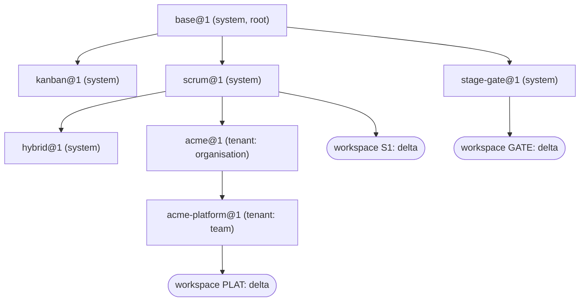

# Template hierarchy across methodologies (spike) — input to ADR-VEC-03

| | |
|---|---|
| **Status** | Proposed |
| **Type** | Spike (architect, Core tier), VEC-66. Extends the single-level model of VEC-45 ([`template-instance-model.md`](./template-instance-model.md)) |
| **Sprint** | VEC-S5 |
| **Requirement** | [ADR-01](../adr/ADR-01-product-requirements-and-features.md) **R-CORE-5** (template → instance), **R-CORE-3** (workflows are data), **R-SEC-2** (tenant isolation) as a seam |
| **Deliverables** | This model; the VEC-45 prototype extended to N levels in [`template-instance-model/`](./template-instance-model/) (91 cases); the draft decision [ADR-VEC-03](../adr/ADR-VEC-03-workflow-and-template-model.md); the shapes for VEC-68 (persistence) and VEC-69 (resolution and API) |
| **Out of scope** | Product modules, migrations, UI. The form contract is VEC-67's; enforcement of transitions and gates is VEC-15's |

## Question and answer

> What is the template model when templates derive from templates, any level can change, and the methodologies differ in more than their columns?

**A template version is a root (a complete document) or a derived level: it pins the exact parent version it extends and carries a delta over that parent's resolved document, in VEC-45's delta vocabulary. A workspace is the last level.** Resolution is VEC-45's two-document merge applied once per level, root first. Every edge is pinned, so a resolved template version never changes and is materialised once, at publish; reading a workspace stays a two-document merge. A change anywhere is a new version; it reaches descendants only through VEC-45's `upgrade`, run edge by edge: for built-ins by the release build, into reviewed files; at runtime automatically where the child's owner chose to follow and the upgrade is conflict-free, and as a previewed, explicit upgrade everywhere else. Occupancy is checked per workspace, so a change at any level is refused exactly for the workspaces it would orphan, and for nobody else. A methodology contributes four section kinds beyond states: item types with a parent hierarchy, a cadence, gates on states with an optional gated-delivery invariant, and locks on paths that lower levels may not change.

Every rule below cites the cases that execute it; statements not prototyped say so.

## 1 · Levels and the chain



The levels are not typed. "Methodology", "organisation" and "team" are roles a level plays, not kinds the model knows: any template may extend any visible template, up to seven template levels, and a workspace may hang off any of them. The shipped hierarchy in [`hierarchy/`](./template-instance-model/hierarchy/) has a root `base`, four methodology templates, and one tenant's organisation level `acme` and team level `acme-platform`.

A **root** is a complete document, as VEC-45's `scrum.v1.json` is. A **derived** document has the same identity members (`template`, `version`, `name`, optional `description`) plus `extends: {"template": <key>, "version": <n>}`, and its sections are a delta. A team template is therefore as small as what the team changed ([`acme-platform.v1.json`](./template-instance-model/hierarchy/acme-platform.v1.json) is four lines of content).

## 2 · Resolution rules for N levels

For a chain `L0` (root), `L1 … Ln` (template levels) and a workspace delta `W`:

1. `E0 = resolve(L0, {})`.
2. `Ek = resolve(strip(Ek-1), Δk)` for k = 1…n, where `Δk` is `Lk` without its identity members and its `locks`.
3. `effective = resolve(strip(En), W)`.
4. `resolve` is VEC-45's `Resolver.resolve`, unchanged in its rules: merge by key, `null` as tombstone, additions complete and placed, arrays replaced whole, order normalised from `stateOrder` and anchors, the effective document validated.
5. `strip` removes the `after`/`before` anchors from the parent's states. **Anchors are level-local**: a level's anchors are resolved against its parent's order and from then on are plain order. Scrum anchors *In Review* after *In Progress*; a child that anchors *On Hold* after *In Progress* gets *On Hold* next to it and *In Review* after, instead of the "two states on one side of an anchor" rejection a flat merge would raise (H3). Anchors left in an effective document are the last level's own.
6. **Locks accumulate and hold**: `locks(Ek) = locks(Ek-1) ∪ locks(Lk)`, and a level cannot drop an ancestor's lock (L1). For every inherited lock `l`, two checks, both enforced (§4): `Δk` (or `W`) does not touch `l`, a path above it or a path below it; and the resolved value at `l` in `Ek` (or the effective document) equals its value in `Ek-1` (or `En`), anchors stripped (L1–L3).
7. **Identity is the last template level's**: `template`, `version`, `name`, `description`, `extends`.
8. **Every level must resolve cleanly on its own**: a published template version is itself a valid, provisionable workflow (H1, H5). A violation is reported with its level, `acme@1: states.qa.after: …`.

Consequences, each executed:

- **Deterministic.** The effective configuration is a pure function of the pinned versions and the delta, independent of member order at every level (H1, I12).
- **Nearest level wins, field by field.** Scrum renaming *In Review* does not override Acme's *Code Review*, while plain Scrum workspaces follow (P3, C5).
- **Reproduces VEC-45.** The hierarchy's `scrum@1` and `kanban@1` resolve to exactly VEC-45's single-level boards: order, states, item types, fields, settings (H2).
- **Materialisation is a cache.** The stored resolution of every version equals re-resolving its chain (H4).
- **Provenance.** For every effective value, the level that last set it (`states.in-review.name ← acme@1`, `states.in-progress.wipLimit ← workspace`), with tombstones removing the element's entries (H6). Shown below and served by the API (§9).

```
== workspace PLAT: base@1 > scrum@1 > acme@1 > acme-platform@1 > instance-platform.json
  backlog      "Backlog"     START_STATE  name<scrum@1 category<scrum@1
  refined      "Refined"     START_STATE  name<acme-platform@1 category<acme-platform@1
  todo         "To Do"       START_STATE  name<base@1 category<base@1
  in-progress  "In Progress" IN_PROGRESS  name<base@1 category<base@1 wipLimit<workspace
  in-review    "Code Review" IN_PROGRESS  name<acme@1 category<scrum@1
  qa           "QA"          IN_PROGRESS  name<acme@1 category<acme@1 wipLimit<acme@1
  done         "Done"        END_STATE    name<base@1 category<base@1 enterFrom<acme@1
  no-go        "No Go"       END_STATE    name<base@1 category<base@1
  cadence {"mode": "sprint", "sprintDays": 7}  locks ["states.done.enterFrom", "states.qa"]
```

## 3 · Publishing a version

A version, once published, is never changed (VEC-45 §1). `Hierarchy.publish` refuses (H5):

- a version that is not the key's next one, including re-publishing an existing one;
- a key owned by another owner; a parent owned by another tenant (a tenant builds on built-ins and on its own templates only); a root from a tenant (**roots are built-in**; open question Q3);
- a parent that is not published; a chain longer than seven template levels;
- a derived version without its own name, one that breaks an inherited lock, or one that does not resolve cleanly.

Keys stay immutable at every level, as in VEC-45: a level that needs a different key removes and adds.

## 4 · Locks and gated delivery

`locks` is a top-level array of paths of exactly these forms: `stateOrder`; a section (`states`); an element (`states.qa`); a member of an element (`states.gate-1.gate`, `states.done.enterFrom`); a member of an object section (`settings.gatedDelivery`, `cadence.mode`). Nothing deeper, so `states.x.gate.approvals` is refused in favour of `states.x.gate`. The member must be one the element kind allows, so a misspelt lock (`states.in-progress.wipLimt`) is refused instead of silently locking nothing, and the element must exist (L3). Locks bind every level below and every workspace (L1, L2), and a parent version that adds a lock on a path a child overrides refuses that child's upgrade (P8).

Enforcement is two checks, and each closes a bypass the other leaves open:

- **On the delta.** No touched path may equal a lock, lie under it, or lie above it. Setting the `gate` object, or tombstoning `gate-1`, reaches the lock on `states.gate-1.gate`; renaming `gate-1` does not, so a team may rename a gate it may not weaken (L1, L3).
- **On the result.** The resolved value at every locked path must be unchanged. This is what makes a `stateOrder` lock mean "the set and order of states is fixed": an anchor on an inherited state, an added state and a removed state all change the order without touching the path `stateOrder`, and all are refused (L3).

**Gated delivery.** Path locks cannot express a flow invariant. Under stage-gate, a level below could otherwise turn *Killed* into a `DELIVERED` end (an unguarded Idea → delivered path), recategorise a stage as a delivered end, or add a new delivered end state. `settings.gatedDelivery: true` makes it an invariant of the resolved document: every way from a `START_STATE` to an `END_STATE` with outcome `DELIVERED`, following `enterFrom`, passes a gate. It is checked at every level and on every workspace delta, so all three are refused while a delivered end state behind Gate 2 is accepted; stage-gate locks the setting itself (L4). Hybrid satisfies it too; Scrum does not, since Backlog reaches Done ungated (L4).

## 5 · Mutation and propagation

**Pinned at every level.** Each derived version pins its parent version and each workspace pins its template version, so publishing anything changes nothing until an upgrade (H4). The alternatives, floating references at some levels or live shared schemes, are rejected in ADR-VEC-03 for the reason VEC-45 gave: nobody could refuse a change that orphans items, and nothing could preview it.

**Built-in edges are rebased at build time.** A release that changes a built-in runs the same rebase over every built-in below it and adds the results to the release as reviewed files, one per version (`scrum.v2.json` extending `base@2`). A built-in that does not rebase cleanly fails the build. At runtime a built-in version is only ever inserted from its file; propagation never publishes one (H8). The rebased files carry the same delta when nothing needed rewriting.

**Follow modes for runtime edges.** Each tenant-template edge and each workspace has a mode chosen by the **child's owner**, because it is the child's configuration that would change: `manual` or `auto`. Proposed default: `manual` (Q1, pending the PO).

**Propagation.** After a release, or a tenant publish of `K@v`, `Propagation.propagate` walks the runtime edges top-down. Each tenant template whose latest version is pinned to an *older* version of `K`, and each workspace pinned to one, is dry-run upgraded with VEC-45's `upgrade` between the two resolved parent versions plus both lock checks. Children are discovered as each level is processed, not up front, and a child already on a newer version is never moved back: two root versions published in quick succession and propagated out of order land each child once, on the newest (P11).

| Child | Upgrade clean | Upgrade has conflicts |
|---|---|---|
| follows `auto`, template | publishes its next version, rebased onto `K@v`, with the rewritten delta; then its own children are visited (P1) | stays pinned; the plan lists the conflicts; nothing below it moves (P7) |
| follows `auto`, workspace | applied in its own transaction, which recomputes the upgrade from the current pin and delta (P10); re-pinned, delta rewritten, revision bumped, board reconciled, one `configuration.changed` (P1, P2) | stays pinned with the conflicts, no event (P5, P6) |
| follows `manual` | stays pinned; the plan carries the dry run as a preview (P4, P9) | stays pinned; the preview shows the conflicts |

```
== release of base@2 (To Do renamed Ready): files the build adds, then the runtime plan; acme set to follow automatically, S1 manual
  file base.v2.json  extends null
  file kanban.v2.json  extends {"template": "base", "version": 2}
  file scrum.v2.json  extends {"template": "base", "version": 2}
  file stage-gate.v2.json  extends {"template": "base", "version": 2}
  file hybrid.v2.json  extends {"template": "scrum", "version": 2}
  template acme@1 -> acme@2, rebased onto scrum@2
  template acme-platform@1 -> acme-platform@2, rebased onto acme@2
  workspace PLAT: acme-platform@1 -> acme-platform@2, revision 1, configuration.changed cause ancestor base@2 [UPDATE todo name "To Do" -> "Ready"]
  workspace S1: stays on scrum@1, manual
```

What a change at a level does, beyond VEC-45's single-edge table, which holds at every edge:

- **Occupancy at any level.** Templates hold no items, so a template publish is never refused for occupancy; each workspace upgrade is. Scrum dropping *In Review* refuses the busy Scrum workspace and deletes the idle one's column (P5). Base dropping *To Do*, which no level customised, rebases every template level and refuses only the busy workspace four levels down (P6).
- **Customisation shields descendants.** Acme had renamed *In Review*, so when Scrum drops it, it is promoted into `acme@2` and kept in place; Acme's busy team is untouched and its board does not change (P5, C9).
- **Template-edge conflicts.** An adoption whose category or outcome disagrees (VEC-45 D8), a lock conflict, or a rebased level that no longer resolves stops that edge only; siblings proceed (P7, P8).
- **Version skipping.** A manual follower upgrades from any older version to any newer one in one step, computed from the two endpoints. That usually equals the stepwise path, but not always: a state the workspace customised, dropped at v2 and re-added elsewhere at v3, stays where the workspace had it when upgraded stepwise (promoted, then adopted) and takes the template's place when upgraded in one step (P9). The upgrade preview shows which.
- **Plans are previews.** A delta written, or a manual upgrade made, between the plan and the apply is never overwritten: the apply recomputes from the workspace's current pin and delta, and skips a workspace no longer on the planned pin (P10).
- **Re-parenting** (switching a workspace or template to a different parent key, say Scrum to Kanban) is **not supported** in v1: keys and meanings differ across methodologies, so it is a migration with a mapping, not an upgrade.

**Events (VEC-46 seam).** One `configuration.changed` per re-pinned workspace, with `cause: {"kind": "ancestor", "template": <published key>, "version": <v>}` naming the version originally published, not the intermediate level (P2). A workspace that stays behind gets none. Each event is written by its workspace's own upgrade transaction, not by the publish transaction (§9). This is a **proposed amendment** to VEC-46's document, which says the events are written "in the publishing transaction"; the contract is unchanged, and the edit is filed as a follow-up (§13), not made in this change.

## 6 · Authority and tenancy

Design, not prototyped beyond ownership (H5); the role model is VEC-71's and the isolation mechanism VEC-14's.

| Level | Owner | May publish | How it lands |
|---|---|---|---|
| root and methodology built-ins | system | Vectis maintainers | files in the repository, reviewed in a PR (rebased built-ins included, §5), inserted by a migration in a release |
| organisation | tenant | the tenant's template administrators | VEC-71 API or UI, or a file import with dry run |
| intermediate and team levels | tenant | template administrators, or a team granted that template key | as above |
| workspace delta | workspace | workspace administrators | `PUT …/configuration/delta` (VEC-45) |

The follow mode of an edge is set by whoever may publish the child. A tenant that publishes its levels from CI and also lets a level follow automatically gets propagated versions it did not author; its CI must dry-run against the server's latest version and export propagated versions back, and a stale file is refused because it is not the key's next version (H5). Roots are proposed to be built-in only (Q3, pending the PO). **Tenancy:** organisation and team levels are tenant data. Their rows carry the tenant; built-in rows carry none and stay readable by every tenant; a tenant row may reference a built-in or a same-tenant parent, never another tenant's (H5). This is more than VEC-45's "global rows readable" note on VEC-14. Whether tenant-authored templates, or more than a fixed number of levels, belong to one edition or another is a founder decision recorded under VEC-14; nothing here depends on it.

## 7 · What a methodology contributes

Sections of one document, all inherited and overridden by the same rules. Members are a **closed set** per element, so a typo such as `wiplimit` is an error rather than an ignored policy, and the [JSON Schema](./template-instance-model/template.schema.json) and the validator accept the same members (H7, S5).

| Section | Shape | Merge | Cases |
|---|---|---|---|
| `states`, `stateOrder` | VEC-45, plus `gate: {"approvals": n}` on a state: leaving it needs a recorded decision with `n` approvals; go, recycle and kill are all decisions; never on an end state | by key; `gate` is an object merged by member | M3–M5, M7 |
| `itemTypes` | `name`, `parents`: the types an item of this type may sit under (absent: top level). Parents must exist and must not loop; removing a type another still names is rejected; dropping a parent type while items sit under one is refused like removing an occupied state (occupancy counts links per type and parent type) | by key; `parents` replaced whole | M1, M3, M4, M6, M8 |
| `fields` | VEC-45 (`type`, `scale`) | by key | M1, M2 |
| `settings` | `defaultItemType`; `gatedDelivery` (§4) | by member | M4, L4 |
| `cadence` | `mode`: `sprint`, `flow` (default) or `phase`; `sprintDays` 1–56, only with `sprint` | by member | M1–M4, M7 |
| `locks` | §4 | union down the chain | L1–L3, P8 |
| `description` | free text on the document and on any element | replaced | H7 |

**The four worked templates** ([`hierarchy/`](./template-instance-model/hierarchy/)):

- **Scrum** (`base` → `scrum`): Backlog before To Do, In Review after In Progress; epic > story or bug > task; Fibonacci points; two-week sprints (M1).
- **Kanban** (`base` → `kanban`): continuous flow inherited from the base; WIP limit 5 on In Progress; no point field (M2).
- **Hybrid** (`base` → `scrum` → `hybrid`, three levels): Scrum's sprints deliver; a *Release Review* gate after In Review is the only way into *Released*; phase > epic > story (M3).
- **Stage-gate** (`base` → `stage-gate`): base's To Do and In Progress removed; Idea → Scoping → Gate 1 → Development → Gate 2 → Launched, with recycle edges back from each gate and *Killed* (the base's `no-go`, still `DISCONTINUED`) reachable from Idea and from the gates; project > deliverable > task and milestones; `phase` cadence; gates locked and delivery gated (M4, L1, L4).

**Waterfall** needs no new concept: `phase` cadence, stages entered strictly in sequence through `enterFrom` (Requirements → Design → Build → Verify → Released), gates optional, for example a sign-off gate before release with `gatedDelivery` (M9). It is not shipped as a fifth built-in because it is stage-gate without mandatory gates; a tenant derives it from `base` in one small level.

**Board mode (VEC-62 seam).** `cadence.mode` decides it: `sprint` is the sprint board, `flow` the Kanban board, and `phase` renders the flow board over the stage states, with gates as columns and no sprint header or sprint planning. VEC-62 covers sprint and flow; phase needs nothing beyond the flow view. Design, not prototyped beyond reading the cadence (M4).

**Not covered, deliberately:** a different workflow per item type (Jira's per-issue-type workflows; reopen in ADR-VEC-03), time-boxed phases with dates, who may approve a gate (a role, VEC-71/VEC-14), and the form a decision is recorded with (VEC-67).

## 8 · Documents, schema and round trip

The PO's 2026-10-01 requirements, and how the model meets them:

- **Canonical JSON is the stored, diffed and reviewed form**, as VEC-45 fixed. The canonical writer is deterministic: parse → write reproduces every checked-in file byte for byte (S1, H1), and resolution does not depend on member order (I12, H1), so a tool that edits one value changes one line.
- **Versioned files reviewed in a PR.** Built-in templates live in the repository as one file per version (`scrum.v1.json`, `scrum.v2.json`); a released version's file is never edited, and a built-in rebased because its parent changed gets its file from the release build, so no built-in version exists only as a row (H8). Tenant templates can be exported (`GET … versions/{v}` returns the authored document) and published from a file with a dry run, so a tenant can keep its levels in its own repository and publish them from CI.
- **A published JSON Schema** ([`template.schema.json`](./template-instance-model/template.schema.json), draft 2020-12) covers roots, derived levels and workspace deltas: shape only, with `null` allowed where a delta may remove or unset. Completeness, references, categories, outcomes and locks are checked by resolution, which reports the same dotted paths. The schema's members match the validator's (S5).
- **YAML is an authoring syntax** that compiles to the canonical JSON, restricted to the JSON-compatible subset of YAML 1.2: no anchors, aliases, tags or merge keys, string keys only, duplicates rejected. **Comments do not survive** the compile, so a round trip through tools is lossless only for the JSON; annotations that must survive go in `description`, which does (H7). Not prototyped: the prototype is dependency-free and has no YAML parser; VEC-76's round-trip tests cover it (Q6).

## 9 · Shapes for VEC-68 and VEC-69

**Persistence (VEC-68)**, a sketch against VEC-45 §5; templates gain an owner and a lineage, so a text key alone no longer identifies one:

```sql
create table workflow_template (
    id         uuid primary key,                    -- time-ordered, like other entities
    tenant_id  uuid,                                -- null: built-in
    key        text not null check (key ~ '^[a-z][a-zA-Z0-9-]{0,31}$'),
    follow     text not null default 'manual' check (follow in ('manual', 'auto')),
    unique nulls not distinct (tenant_id, key)      -- one key per tenant, one per built-in
);
-- the unique constraint alone lets a tenant key equal a built-in key; decision: no shadowing, so a
-- `before insert` trigger refuses a tenant row whose key a built-in row has (and a migration adding a
-- built-in key a tenant already uses fails, to be resolved by hand). The prototype has one global namespace.
create table workflow_template_version (
    template_id      uuid not null references workflow_template (id),
    version          int  not null check (version >= 1),
    parent_id        uuid,
    parent_version   int,
    document         jsonb not null,                -- as authored: complete for a root, identity + delta otherwise
    resolved         jsonb not null,                -- materialised at publish; immutable inputs, so never stale
    resolver_version int  not null,                 -- recomputed at startup if the resolution rules change
    cause            jsonb not null,                -- {"kind": "authored"} or {"kind": "propagated", "from": "base@2"}
    published_at     timestamptz not null default now(),
    primary key (template_id, version),
    foreign key (parent_id, parent_version) references workflow_template_version (template_id, version),
    check ((parent_id is null) = (parent_version is null))
);
-- a `before update or delete` trigger raises: versions are immutable
alter table workspace
    add column template_id      uuid   not null,
    add column template_version int    not null,
    add column config_delta     jsonb  not null default '{}'::jsonb,
    add column config_revision  bigint not null default 0,
    add column follow           text   not null default 'manual' check (follow in ('manual', 'auto')),
    add foreign key (template_id, template_version) references workflow_template_version (template_id, version);
create table template_propagation (                 -- the plan, durable: drives the job, the UI and the audit
    id uuid primary key, origin_id uuid not null, origin_version int not null,
    target_kind text not null check (target_kind in ('template', 'workspace')), target_id uuid not null,
    planned_from int  not null,                     -- the pin the plan saw
    planned_revision bigint,                        -- the workspace revision the plan saw (null for a template)
    status text not null default 'pending'
        check (status in ('pending', 'applied', 'blocked', 'manual', 'skipped', 'failed')),
    attempts int not null default 0,
    conflicts jsonb not null default '[]', notes jsonb not null default '[]',
    created_at timestamptz not null default now(), finished_at timestamptz,
    unique (origin_id, origin_version, target_kind, target_id)   -- an at-least-once job re-inserts nothing
);
```

`board_column` keeps VEC-45's `key`, `on_board` and deferrable ordinal constraint. Built-in versions are inserted only by migrations from their files (§5); everything below is the runtime job.

**The propagation job**, in the shape VEC-71 should build (the prototype runs it synchronously; P10 and P11 execute its two rules):

1. **Publish** (one transaction): lock the `workflow_template` row of the key being published (`select … for update`), check the version is the next one, insert the version row, and insert `pending` rows for its **direct** children only. Serialising per key means two publishes of one key, or an author and a propagation both producing `scrum@2`, cannot race: the second waits, then fails the next-version check, and its row is marked `failed` with the reason.
2. **Template child** (one transaction per child): lock that child's key row; re-read its latest version; if it is no longer pinned to an older version of the parent, mark the row `skipped` (nothing is ever moved back, P11); recompute the rebase; if `auto` and clean, publish the next version as in step 1, which inserts `pending` rows for *its* direct children, discovered now rather than at the original publish; otherwise `manual` or `blocked`.
3. **Workspace child** (one transaction per child): lock the workspace row first, the same first lock every writer takes (consistent with VEC-73's lock order, so it serialises with item writes and occupancy counted under it is stable); if it is no longer on `planned_from`, `skipped`; otherwise **recompute** the upgrade from its current delta and occupancy (the planned preview is never written; a revision past `planned_revision` is only noted, P10); then `blocked`, or VEC-45's write path: reconcile `board_column`, store the delta, bump the revision, append `configuration.changed`.
4. **Retries.** A row that throws is retried with `attempts + 1` and marked `failed` after a bound; the unique key makes re-planning idempotent. One huge transaction across all descendants would hold every row lock at once and fail as a whole on one conflict; per-child transactions fail per child, which is what the plan reports.
5. **Tenant context.** Each child transaction runs as the application role with the **child's** tenant set (`set local app.current_tenant_id`), so row-level security applies to it exactly as to a request from that tenant; the job reads its queue rows through a narrow role that sees `template_propagation` across tenants and nothing else. Built-in rows carry no tenant and are readable by every tenant. Reads: `tenant_id is null or tenant_id = current tenant`; writes: own tenant only.

**Resolution and API (VEC-69)**, extending VEC-45 §4:

```
GET  /api/v1/workspaces/{key}/configuration                       ETag: "<revision>"
     { "template": {"key", "version", "latestVersion", "follow",
                    "chain": [{"key": "base", "version": 1, "owner": "system", "name": "Base"}, …]},
       "revision", "delta", "overrides", "effective",
       "provenance": {"states.in-review.name": "acme@1", …},       // ?include=provenance
       "pending": {"toVersion", "status": "blocked" | "manual", "conflicts": [], "notes": []} }
PUT  /api/v1/workspaces/{key}/configuration/delta   If-Match       → 200 | 412 | 422 (lock violations included)
POST /api/v1/workspaces/{key}/configuration/upgrade {"toVersion", "dryRun"}   (VEC-45, unchanged)
GET  /api/v1/templates                                             visible templates: key, owner, latest, parent, follow
GET  /api/v1/templates/{key}/versions/{v}                          {document, resolved, parent, provenance}
POST /api/v1/templates/{key}/versions  {document, dryRun}          → 201 {version, plan[]} | 422   (VEC-71; JSON or YAML body)
GET  /api/v1/templates/schema                                      the JSON Schema, versioned
```

Server-side resolution reads one materialised row plus the workspace delta, as in VEC-45. A violation should carry its level as its own member, `{"field": "states.qa.wipLimit", "level": "acme@1", "message": …}`, inside whatever error shape VEC-69 ratifies, not the prototype's string prefix.

## 10 · The workflow runtime and the VEC-76 subset

VEC-15's runtime is the extracted state-machine library: transitions `(from, event, to)` with an optional guard. `Workflow.definition` compiles an effective configuration to the generic subset an adapter can load, and is the subset **VEC-76 should cover**:

```json
{"states": {"<key>": {} | {"end": "<outcome label>"}}, "initial": ["<key>", …],
 "transitions": [{"from": "<key>", "event": "<key>", "to": "<key>", "guard": "<name>"}]}
```

- `enterFrom` lists a state's allowed sources; absent means every other state; `[]` means none, so the state is entered only on creation (Stage-gate's Idea).
- The event of a transition is its target key: a tracker move is "go to that state".
- Every transition leaving a gate carries the guard `gate:<state>`; the host binds it. The document never contains code.
- End states carry their outcome as an opaque label; categories, boards, item types, cadence and locks stay VEC's and are not in the subset (M5).

Stage-gate compiles to ten transitions, none from Idea straight to Development, and every way out of a gate guarded (M5); Hybrid has exactly one way into Released, through the release gate (M3). VEC-15 can build its machine from this object with the library's builder without a parse; the adapter's loader serves import, export and other consumers. Whether VEC-76 is built now is Q7.

## 11 · Prior art

From the vendors' public documentation, not hands-on evaluation.

- **Azure DevOps inherited processes.** Locked system processes (Agile, Scrum, CMMI, Basic); a project uses an *inherited* process derived from one, which adds work item types, fields and states and hides, rather than deletes, inherited ones; changes apply to every project using the process at once. Its state categories (Proposed, In Progress, Resolved, Completed, Removed) carry the same "removed is an end, not a delivery" idea as our outcome. **Take:** locked built-ins, categories that carry meaning, hide rather than delete for inherited elements (our `onBoard` and tombstone-while-empty). **Avoid:** a single level of inheritance, which forces copies for organisation and team variants, and live propagation with no preview and no per-project refusal. Our single-parent tree moves that copy along one axis: an organisation with several methodologies publishes its layer once per methodology (Q8, and the multi-parent alternative in ADR-VEC-03).
- **Jira schemes.** A project binds a workflow scheme (issue type → workflow), field configuration scheme, screen scheme and others; schemes are shared by reference, and status categories (To Do, In Progress, Done) sit beside a separate resolution field. Changing statuses on an active shared workflow requires migrating the issues in removed statuses. **Take:** occupancy-driven change control (we refuse rather than remap in v1), per-type workflows as a later option. **Avoid:** many orthogonal scheme kinds, sharing without versions (an edit lands on every project at once), copy-on-customise with no inheritance, and "Done with resolution Won't Do" counting as done, which our outcome replaces.
- **Open source: OpenProject and Taiga.** OpenProject configures types, statuses and a workflow matrix per role and type globally, with projects enabling types; project templates are copied. Taiga creates a project from a template by copying it. **Take:** the role × transition matrix as a later shape for gate approvers. **Avoid:** copy semantics, which lose every later improvement; VEC-45 rejected them for the same reason.

## 12 · Prototype

[`Hierarchy.java`](./template-instance-model/Hierarchy.java) (resolution, locks, publishing, provenance), [`Propagation.java`](./template-instance-model/Propagation.java) (the release build's rebase, runtime propagation, plan and apply), [`Workflow.java`](./template-instance-model/Workflow.java) (the VEC-76 subset), the extended [`Validation.java`](./template-instance-model/Validation.java), the cases in `HierarchyCases.java`, `MethodologyCases.java` and `PropagationCases.java`, and the documents in [`hierarchy/`](./template-instance-model/hierarchy/). `Resolver.java` gained the `cadence` section and the check on narrowed item type parents. Same command as VEC-45, JDK 22+, non-zero exit on any failure:

```bash
java docs/spikes/template-instance-model/TemplateModelSpike.java
```

Result on JDK 25.0.3: VEC-45's 58 cases unchanged, then 33 more:

```
-- hierarchy: resolution
PASS H1   every level of the shipped hierarchy publishes and resolves on its own; files canonical; member order irrelevant
PASS H2   the hierarchy's scrum and kanban give VEC-45's single-level boards: order, states, item types, fields, settings
PASS H3   anchors are level-local: scrum anchors In Review after In Progress, a child anchors On Hold there too; no collision, the child's is nearest
PASS H4   pinned at every level: base@2 and scrum@2 change nothing pinned to acme-platform@1; every materialised resolution equals re-resolving its chain
PASS H5   publish refuses: a re-published version, an unknown parent, another tenant's parent or key, a tenant root, no name, too many levels, a level that does not resolve
PASS H6   provenance: every effective value names the level that last set it, root to workspace
PASS H7   members are a closed set: a typo is an error, not an ignored policy; description is allowed and survives resolution and round trip
PASS S5   the published JSON Schema and the validator accept the same members, section by section; the schema is canonical
-- hierarchy: locks
PASS L1   stage-gate locks its gates and the entries they guard: a level below cannot drop or weaken a gate or rewire those entries, may rename it; a workspace neither; locks accumulate
PASS L2   an organisation's lock binds every team and workspace below it: QA cannot be loosened, Done's entry cannot be widened
PASS L3   no way round a lock: a lock below member level or on a misspelt member is refused; setting the gate object hits a lock on it; a stateOrder lock holds against anchors, additions and removals, not only stateOrder
PASS L4   gated delivery: a level below stage-gate cannot open an ungated way to a DELIVERED end, whether by turning No Go into a delivery, recategorising a stage, or adding an end state; one behind Gate 2 is fine; the invariant itself is locked
PASS H8   built-in edges rebase at build time: a release of base@2 adds one reviewed file per rebased built-in (canonical, delta unchanged); runtime propagation never publishes a built-in
-- methodologies
PASS M1   Scrum: two-week sprints, epic > story or bug > task, Fibonacci points, Backlog before To Do
PASS M2   Kanban: continuous flow inherited from the base, a WIP limit on In Progress, no point field, no sprint length
PASS M3   Hybrid, three levels deep: sprints from Scrum, phase > epic > story, and a release gate that is the only way to Released
PASS M4   Stage-gate: phases not sprints; stages and gates in order; Base's To Do and In Progress removed; project > deliverable > task, milestones
PASS M5   workflow definition for the state-machine library: enterFrom becomes transitions, a gate becomes a named guard on every way out of it, ends carry their outcome
PASS M6   item type hierarchy: an unknown parent, a loop, or removing a type another still names as parent is rejected
PASS M7   cadence and gates validate: a closed set of modes, a sprint length only with sprints, no gate on an end state, approvals a positive count
PASS M8   narrowing an item type's parents is refused while items sit under a parent it drops, at a delta write and at an upgrade; allowed when none do
PASS M9   waterfall maps without a new concept: phase cadence, stages entered strictly in sequence, gates optional (a sign-off gate before release, with gated delivery, also resolves)
-- hierarchy: mutation and propagation
PASS P1   a change at the root reaches a workspace four levels down, through the release build and then automatic edges; no delta on the way is rewritten
PASS P2   one configuration.changed per re-pinned workspace, each naming the version originally published; none for a workspace left behind
PASS P3   nearest level wins, field by field: Scrum renames In Review; Acme had renamed it, so Acme's teams keep Code Review; plain Scrum workspaces follow
PASS P4   a manual edge stops propagation: Acme stays on scrum@1 and is shown the dry run; nothing below it moves; it upgrades later, explicitly
PASS P5   occupancy at the next level: Scrum drops In Review; a busy workspace is refused and stays, an idle one deletes the column; Acme had customised it, so it is promoted into acme@2 and Acme's busy team is untouched
PASS P6   occupancy four levels down: Base drops To Do, which no level customised; every template level rebases, the busy workspace is refused, its idle sibling deletes the column
PASS P7   a conflict at a template edge: Ops had added Blocked as a start state, Scrum adds it in progress; Ops is refused and stays with its workspaces, Scrum's other children move on
PASS P8   a parent that adds a lock on a path a child overrides refuses the child's upgrade, at a template edge and at a workspace
PASS P9   a manual workspace sees each publish as a preview and may skip versions; a skip equals the stepwise path here, but can differ: promoted at v2 and re-added at v3, stepwise keeps the instance's place, the skip takes the template's
PASS P10  apply recomputes in the workspace's own transaction: a delta written after the plan is kept, not overwritten by the plan's preview; a workspace upgraded meanwhile is skipped
PASS P11  two root versions in quick succession, propagated out of order: children are discovered as each level is processed and only an older pin is upgraded, so ops lands once on base@3 and is never moved back to base@2

91 passed, 0 failed
```

**Teeth.** Each new mechanism was mutated in a scratch copy (32 mutants), and every mutant fails the cases named: keeping parent anchors (H2, H3, P7); no lock check on deltas (L1, L2, P8); a set path not reaching a lock below it (L1); no check on locked values (L3); locks deeper than a member, or on unknown members (L3); child locks replacing the parent's (L1, L2); no gated-delivery check (L4); every tenant edge automatic (P4); built-ins rebased at runtime, or the release build skipped (H8, the latter also P1, P2); propagation allowed to downgrade (P11); a manual workspace upgraded (P9); applying despite conflicts at a template (P7) or a workspace (P5, P6); apply writing the plan's preview, or ignoring the pin (P10); an upgrade ignoring the new parent's locks (P8); no owner check, tenant roots, no depth limit, the depth limit off by one, or a nameless derived version (H5); provenance ignoring tombstones (H6); unchecked narrowing of parents (M8); no gate guard, or `enterFrom` ignored by the projection (M3, M5, M9); open member sets (H7); no item type loop check (M6); a sprint length outside sprints, or a gate on an end state (M7). One mutant, gates not stopping a path, fails no case by name: it makes the shipped stage-gate itself unpublishable, and the run aborts with a non-zero exit.

**Not prototyped:** YAML (§8), the role model (§6), the propagation job's queue, retries, row locks and tenant context (§9; its two ordering rules are, P10 and P11), the board for phase mode (§7).

## 13 · Effect on backlog items

| Item | Proposed edit |
|---|---|
| **VEC-68** (persistence) | Scope from §9: `workflow_template` and `workflow_template_version` (owner, parent pin, authored and resolved documents, `resolver_version`, immutability trigger, the no-shadowing trigger), the workspace's template id, version, delta, revision and `follow`, `template_propagation` with its statuses and unique key, VEC-45's `board_column` changes; built-in templates loaded from per-version files into rows; provisioning by reference with an optional initial delta. Out: publishing by tenants and the job (VEC-71). Ready to refine and estimate. |
| **VEC-69** (resolution and API) | Scope from §9: resolution over the materialised version, `chain`, `provenance`, `pending` in the configuration view, lock violations in 422, `GET /templates`, `GET /templates/{key}/versions/{v}`, `GET /templates/schema`; violations carry their `level`. Consumers unchanged. |
| **VEC-71** (template authoring) | Scope: `POST /templates/{key}/versions` with dry run and plan; the propagation job of §9 (per-key lock, children discovered per level, per-child transactions that recompute under the workspace row lock, retries, tenant context); follow modes; locks and `gatedDelivery`; the authority table of §6; YAML and JSON bodies; file export and import. Plus the release-build tool that rebases built-ins into files (§5). Likely an epic: publish + plan; propagation job; build tool; authoring UI. |
| **VEC-67** (forms spike) | Section structure fixed: build on `itemTypes` (with `parents`), `fields`, `states.<k>.gate` and `cadence`; form members it adds join the closed member set and the schema, inherited and lockable like the rest. Use `hierarchy/scrum.v1.json` and `hierarchy/stage-gate.v1.json` as its two templates. Can start now. |
| **VEC-15** (workflow engine) | Build the runtime machine from `Workflow.definition` (§10). Vocabulary to enforce: `enterFrom` (including `[]`), `wipLimit`, `gate` guards; locks and `gatedDelivery` are enforced at configuration-write time by the configuration service, not by the engine. |
| **VEC-62** (scrum board) | Board mode from `effective.cadence.mode`: `sprint` → sprint board, `flow` → Kanban board, `phase` → flow board over the stages with gate columns; no third view needed. |
| **VEC-76** (definition adapter) | Format fixed: the subset of §10, not VEC's document. VEC compiles to it; the gate in its item passes with that scope. Build only if a consumer beyond VEC needs document-defined machines (Q7). |
| **VEC-14** (tenancy) | The re-refine note it already carries applies: template versions are tenant data with a nullable `tenant_id`, parents restricted to built-in or same tenant, writes own-tenant only. Edition questions stay the founder's. |
| **VEC-46** (done) | Proposed amendment to `realtime-transport.md`, filed as a follow-up doc edit and **not** made in this change: ancestor-caused events are written by each workspace's own upgrade transaction (§5, §9), not "in the publishing transaction". No contract change. |
| **VEC-10** (New Project form) | The template choice lists `GET /templates` (built-in and own tenant), not two built-ins; otherwise as split. |
| **VEC-28** | Unchanged from VEC-45 (point scale and delivery by outcome); a template without `storyPoints` (Kanban, stage-gate) has no velocity, only throughput. |
| **VEC-54** (backlog import) | Unchanged: provisions from `scrum` with the Refined delta; with the hierarchy that is `scrum@<latest>`. |

## 14 · Open questions for the PO

Each is also listed in ADR-VEC-03, so approving the ADR answers them explicitly.

1. **Q1 Default follow mode.** Proposed: `manual` for every runtime edge unless the child's owner sets `auto`. The alternative, `auto` by default within one tenant, propagates organisation changes faster and surprises teams more.
2. **Q2 Depth.** Proposed: at most seven template versions in a chain, root included (`MAX_TEMPLATE_LEVELS`); the workspace is not counted. Any limit works; it bounds a publish's fan-out and a provenance listing.
3. **Q3 Tenant roots.** Proposed: roots are built-in only, so every workflow keeps the base's categories and end states and a base improvement can reach everything. Allowing tenant roots frees "not agile at all" processes from `base` at the cost of that reach.
4. **Q4 Item type parents: may or must.** Proposed: `parents` says where a type may sit; an item without a parent is always allowed. A `requiresParent` flag is additive.
5. **Q5 Gate governance.** `gatedDelivery` closes every ungated way to a delivered end, whether by a new end state, a changed outcome or category, or a wider `enterFrom` (L4). Confirm it as a configuration invariant checked on write, rather than a runtime policy in VEC-15, and whether further invariants (for example "every gate has at least N approvals") are wanted.
6. **Q6 YAML comments.** Canonical JSON is the stored form and YAML comments are lost on compile. Confirm `description` as the annotation that survives, or require YAML sources to be kept alongside (two sources of truth).
7. **Q7 VEC-76 now or later.** VEC does not need the adapter to run; it needs it only for document import and export. Build now for reuse, or park until a second consumer asks.
8. **Q8 One organisation, several methodologies.** With one parent per level, an organisation running Scrum and Kanban teams publishes its layer once per methodology (`acme-scrum`, `acme-kanban`), locks included. ADR-VEC-03 rejects multiple parents and mixins for v1 and records a lock-and-invariant-only overlay as the reopen path. Confirm the duplication is acceptable for now.
