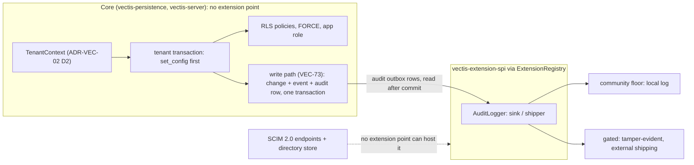

# Tenant isolation (spike): draft of the multi-tenant isolation & feature gating ADR (numbered when written)

| | |
|---|---|
| **Status** | Proposed |
| **Type** | Spike (Extensibility & Architecture tier), VEC-14. Written to be lifted into the multi-tenant isolation & feature gating ADR (numbered when written). |
| **Sprint** | VEC-S5 |
| **Requirement** | [ADR-VEC-01](../adr/ADR-VEC-01-product-requirements-and-features.md) **R-SEC-2**: tenant isolation fails closed (PostgreSQL row-level security; a missing tenant binding makes rows invisible). Constrained by [ADR-VEC-02](../adr/ADR-VEC-02-identity-and-auth.md) D2 (the tenant is resolved by a registry and bound once per request with `SET LOCAL`) and [ADR-VEC-03](../adr/ADR-VEC-03-workflow-and-template-model.md) decision 7 (built-in template levels are readable by every tenant; tenant levels are tenant data). |
| **Deliverable** | This document, plus a throwaway harness in [`tenant-isolation/`](./tenant-isolation/): a standalone Maven project outside the reactor, with its recorded output in [`tenant-isolation/results/run-all.txt`](./tenant-isolation/results/run-all.txt). There is no production code and no migration on `main`. |
| **Reading** | The ADR part is Context, Decision, Rules and Consequences. Findings §1 to §4 are the evidence. The appendices map the acceptance criteria, mark each claim as measured or argued, and say how to reproduce. |
| **Unblocks** | VEC-32 (federation), VEC-33, VEC-35 (sign-in), VEC-80 (RLS input) and VEC-81 (tenant binding). It constrains VEC-74 (the stream's feed and prune job) and VEC-71 (template publish and propagation). |

## Context

R-SEC-2 makes PostgreSQL row-level security the mechanism of tenant isolation, and requires it to fail closed. ADR-VEC-02 decided where the tenant comes from: a verified token, mapped through a registry Vectis owns, bound once per request into a `TenantContext` and applied with `SET LOCAL`. What nobody had shown is that this binding holds on the runtime query path, which is the reactive Vert.x pool (`io.vertx.mutiny.sqlclient.Pool`, through `quarkus-reactive-pg-client`). The pool hands one physical connection from request to request with no reset in between. The schema on `main` still has no tenant column and no policy.

The question: **can PostgreSQL RLS, driven by a tenant setting on the reactive pool, deliver fail-closed isolation without leaking tenant context between pooled connections, and at an acceptable cost on the read path?** And, separately: **where does the Community core hand off to gated capabilities (SOC 2 audit logging, SCIM)?**

## Decision

1. **RLS is the isolation boundary, bound per transaction, and it holds on the reactive pool.** Every tenant-scoped statement runs inside `pool.withTransaction`. The transaction's first statement is `select set_config('app.current_tenant_id', $1, true)`, which is the parameterised form of `SET LOCAL`. 50,000 interleaved requests over the 20 connections of the product's default pool, with 200 in flight, produced **0 leaks**. The probe includes failed and abandoned transactions. The negative control (a session-level `SET`) leaked 1,319 times in 5,000 requests, so the probe does detect a leak when one exists (§1).
2. **Layers: RLS enforces; an application predicate is optional and never relied on.** A query may also say `where tenant_id = $n` when that helps the planner or the reader. The guarantee is the policy alone, because it is the only layer that still holds when a query forgets its predicate.
3. **The cost is the binding's round trips, not the policy.** On the board read path at 1,000 tenants and 100,000 items, measured sequentially: application filtering in one statement p50 0.42 / p95 0.67 ms; RLS p50 1.41 / p95 1.77 ms; RLS with the binding pipelined into the query p50 0.89 / p95 1.62 ms; application filtering inside a transaction p50 1.06 / p95 1.62 ms. The plans are identical: the same index scan, with the tenant predicate as a filter (§2). The per-read cost is acceptable. A board opens with one snapshot read, and any request that writes already runs in a transaction.
4. **Isolation is core, not an extension.** Policies, the binding and the app role belong to `vectis-persistence` and `vectis-server`, whichever edition ships. Of the two named capabilities, the SPI can host only the *sink* of SOC 2 audit logging (`AuditLogger`), and only once the event is written in the change's transaction. It cannot host SCIM, which needs inbound endpoints and an identity store that no extension point offers (§3). Which edition carries tenancy, audit and SCIM is the founder's call; the options are in §4.

## Rules

These rules are the normative part of the decision.

**Roles.** The runtime role is `NOSUPERUSER NOBYPASSRLS` and owns no table. Migrations run as a separate owner role, on the JDBC datasource that already exists only for Flyway. Every tenant-scoped table is `ENABLE` **and `FORCE`** row level security. Demonstrated (§1): a superuser sees all 100,000 rows with no binding, and so does the owner when `FORCE` is off. Today both datasources use one credential, and the test container's user is a superuser. A suite run that way would pass every RLS test vacuously, so tests must connect as the app role.

**Binding.** `select set_config('app.current_tenant_id', $1, true)` is the first statement of every tenant-scoped transaction. It is parameterised, unlike `SET LOCAL`, which takes no bind parameter and would invite string concatenation. Never use `is_local = false`, a plain `SET`, or a binding outside a transaction:

- Outside a transaction, `set_config(…, true)` lasts one statement, so the binding is lost. That fails closed, but the request then sees nothing.
- A session `SET` stays on the pooled connection for the next borrower. That is the leak the control demonstrates.

The binding may be pipelined with the transaction's next statement. The Vert.x client sends commands on one connection in order, so this saves a round trip: in every pipelined read the binding was in force, which is why every one of them returned rows.

**Policy expression.** `tenant_id = nullif(current_setting('app.current_tenant_id', true), '')::uuid`. The `nullif` is required. Once a session has set the variable, it reads back as `''` (not null) after the transaction ends, and `''::uuid` raises an error (demonstrated, §1). Without `nullif`, an unbound read on a used connection errors instead of returning nothing. That still fails closed, but as an error, not as zero rows.

**Where `tenant_id` lives.** It is a column on every tenant-scoped table (`workspace`, `board`, `board_column`, `item`, `sprint`, `workspace_event`, template levels, and every later table), so that each policy is a column comparison and not a join. Its consistency with the parent row is kept by composite foreign keys, for example `(workspace_id, tenant_id) references workspace (id, tenant_id)`. Argued, not prototyped.

**References across rows.** Referential checks do not apply RLS. A row may therefore reference a parent its tenant cannot see, unless the policy's `WITH CHECK` requires the parent to be visible, for example `parent_id is null or exists (select 1 from template_level p where p.id = template_level.parent_id)`. Demonstrated (§1): with a policy on `tenant_id` alone, tenant A extended tenant B's template level. The outer column must be qualified with the table name: unqualified, `parent_id` binds to the subquery's own row and the check refuses every insert.

**Global rows.** Built-in template levels have `tenant_id` null. Their read policy is `tenant_id is null or tenant_id = <bound>`, and their write policies require `tenant_id = <bound>`. So built-ins are readable by every tenant, even unbound, and writable by none. They are seeded by the owner, that is, by a release. Demonstrated (§1).

**Cross-tenant system work.** Some paths serve many tenants by design: the real-time feed and its catch-up poll (VEC-74), the event prune job, and template propagation (VEC-71). These bind each tenant in turn (the workspace row names its tenant), or call a narrow `SECURITY DEFINER` function that takes the workspace id. They never share a `BYPASSRLS` pool with request paths. Argued.

**Write path.** VEC-73's write-path helper already opens the transaction and locks the workspace row first. The binding becomes that transaction's first statement, pipelined with the lock, so writes pay no extra round trip. Argued.

## Consequences

**Adopted, this means:**

- The persistence layer gains one entry point for tenant-scoped work: a transaction that binds the request's `TenantContext` first. A tenant-scoped query issued through the bare pool returns nothing, which fails closed and shows up in the first test that exercises it.
- Two database credentials per deployment: the owner for migrations, the app role at runtime. Tests run as the app role.
- Every tenant-scoped table gains `tenant_id`, a policy, `FORCE`, and a composite foreign key to its parent. That includes the tables VEC-73 adds.
- Template levels need no re-refinement. One nullable `tenant_id` column and four policies cover built-in and tenant levels, as ADR-VEC-03 decision 7 requires (§1). The change is additive.
- `ExtensionRegistry` stays the seam for gated *implementations* of a contract the core defines. Isolation itself is not behind it.

**Costs accepted.**

- About one database round trip per tenant-scoped request, for the transaction and the binding: about 0.5 to 1 ms in the measured environment (§2). A request that already runs in a transaction pays only the pipelined binding.
- Every read runs in a transaction, `BEGIN` and `COMMIT` included. A read issued as a bare pool statement is not merely slower: it returns nothing.
- Cross-tenant system jobs bind per tenant, or go through reviewed `SECURITY DEFINER` functions.

**What would reopen it:** a leak observed by the probe under a different pool configuration, a Quarkus or Vert.x upgrade, or PgBouncer in transaction mode (the probe is the regression test); a read path where the binding round trip measurably dominates (very chatty requests that cannot share a transaction); a requirement for database-level isolation stronger than rows (schema or database per tenant, for example for data residency).

## Findings

The sections below are the evidence the decision rests on. They are not part of the ADR text.

## 1 · Correctness: can request B see request A's tenant?

**Setup.** PostgreSQL 16.14 (`postgres:16-alpine`, default settings). The pool is Quarkus 3.37.1's reactive PostgreSQL client with the product's defaults (`max-size` unset, so 20 connections), connected as `spike_app` (`NOSUPERUSER NOBYPASSRLS`, owner of nothing). The schema owner is a separate role, `spike_owner`. `item` copies the product's columns plus `tenant_id`; RLS is enabled and forced, with the policy under [Rules](#rules). There are 1,000 tenants with 100 items each.

**Probe** ([`LeakProbe.java`](./tenant-isolation/src/main/java/io/vectis/spike/tenancy/LeakProbe.java)). Requests are interleaved at random across six kinds, for random tenants, with 200 in flight against 20 connections, so each connection passes from kind to kind and tenant to tenant about 2,000 times. Every read reports the backend pid that served it, the tenant setting it saw, the rows it could see, and how many of those belong to another tenant. A leak is any bound read that sees another tenant's row, sees fewer than its own 100 rows, or sees a setting other than its tenant. For an unbound read, a leak is any row at all, or any non-empty setting.

| Kind | What it does | Expected |
|---|---|---|
| `BOUND` | `withTransaction`: `set_config(t, true)`, then read | exactly tenant t's 100 rows |
| `UNBOUND` | a bare pool statement, no binding | 0 rows |
| `UNBOUND_TX` | `withTransaction`, no binding | 0 rows |
| `FAILING` | binds, then fails (`1/0`) inside the transaction | rolled back |
| `CANCELLED` | binds, then is abandoned by its subscriber after 5 ms, mid-transaction (a request timeout) | the next borrower sees nothing of it |
| `BOUND_OUTSIDE_TX` | `set_config(t, true)` as its own pool statement, then a read as another | 0 rows: the binding is lost, not leaked |

Results, as recorded in [`results/run-all.txt`](./tenant-isolation/results/run-all.txt):

```
probe: binding=LOCAL requests=50000 in-flight=200 seed=14 elapsed=9526 ms
probe: kinds {BOUND=29859, UNBOUND=7436, UNBOUND_TX=3532, FAILING=3530, CANCELLED=3085, BOUND_OUTSIDE_TX=2558}
probe: 20 physical connections served the reads; requests per connection min 2034 max 2283
probe: 9268 reads came straight after a BOUND request on the same connection (completion order)
probe: expected failure x3530  FAILING: PgException ERROR: division by zero (22012)
probe: expected failure x3085  CANCELLED: TimeoutException
probe: LEAKS 0 {}
```

**Negative control:** the same probe with the binding made session-level (`set_config(t, false)`, a plain `SET`):

```
probe: binding=SESSION requests=5000 in-flight=200 seed=14 elapsed=1102 ms
probe: LEAKS 1319 {UNBOUND=726, UNBOUND_TX=338, BOUND_OUTSIDE_TX=255}
probe: leak example Outcome[kind=UNBOUND, tenant=8f190a5e-…, pid=439, setting=de02480c-…, visible=100, foreign=100, error=null]
```

The control shows two things. The probe detects a leak when there is one: an unbound request on a connection that served tenant `de02480c…` saw all 100 of its rows. And the binding's scope, not the pool, is what decides isolation. Vert.x hands connections back without any reset (no `DISCARD ALL`), so whatever a session sets stays on the connection.

**Verdict on sub-question 1: no leak.** A transaction-local binding inside `pool.withTransaction` scoped to that transaction in every case tried, including rollbacks and transactions abandoned mid-flight. The client's per-connection prepared-statement cache did not carry a binding either: the probe's read is one prepared statement, executed about 2,000 times per connection across tenants. Every request of the run counted: none was dropped by the harness, and the failures are exactly the `FAILING` and `CANCELLED` kinds.

**Who bypasses the policy** (`./run.sh bypass`):

```
superuser vectis, unbound, sees 100000
owner, FORCE on, unbound, sees 0
owner, FORCE off, unbound, sees 100000
app, unbound, sees 0
app, never set, setting reads NULL
app, after a committed local binding, setting reads []
ERROR:  invalid input syntax for type uuid: ""
```

The last two lines are why the policy needs `nullif`. The first three are why the runtime role must be neither superuser nor owner, and why `FORCE` is on. The product's test database user today is the container's superuser.

**Template levels** (ADR-VEC-03 decision 7; `./run.sh templates`):

```
templates: PASS  tenant A sees the built-in and its own level, not B's
templates: PASS  unbound sees the built-in only
templates: PASS  tenant A cannot write a built-in level (tenant_id null)
templates: PASS  tenant A cannot update the built-in
templates: PASS  tenant A cannot write a level owned by B
templates: PASS  tenant A cannot extend B's level (policy checks the parent is visible)
templates: SHOWN  with a policy on tenant_id alone, tenant A CAN extend B's level (a foreign key check does not apply RLS)
```

This is additive to the VEC-45 and VEC-66 constraints: one nullable column and four policies, no change to the template model. Authority *within* a tenant (who in the tenant may publish which level, VEC-71) sits above row visibility and is not decided here.

## 2 · Cost: the board read path

**Query:** `ItemRepository.findByColumn`, which reads every item of one column of one board in rank order. Its columns and its index `(board_id, column_id, rank)` are copied from `main`. Each request picks a random tenant and one of its three columns, about 33 rows, and must get rows back.

**Dataset:** 1,000 tenants, 100 items each (100,000 rows), in `item` (RLS) and in an identical `item_plain` (no RLS, same indexes, plus an index on `tenant_id` in both).

**Modes:**

- `APP`: `item_plain … where tenant_id = $1 and board_id = $2 and column_id = $3`, as one pool statement.
- `APP_TX`: the same, inside `withTransaction`.
- `RLS`: `withTransaction`, then `set_config`, then the product's query unchanged on `item`.
- `RLS_PIPELINED`: as `RLS`, with `set_config` and the query sent together.
- `RLS_AND_APP`: the policy, plus the predicate in the query.

**Run shape:** 1,000 warm-up requests per mode are discarded, then 5 rounds of 2,000 requests per mode, with the mode order shuffled each round. This runs once sequentially and once with 16 requests in flight (below the pool's 20).

**Environment:** Apple M3 Pro (11 cores, 18 GB); macOS; Docker Desktop 29.8.2 (VM with 11 vCPUs, 8 GB); PostgreSQL 16.14 (`postgres:16-alpine`, default settings) in a container; the harness on the host (OpenJDK 25.0.3, Quarkus 3.37.1, JVM mode), connecting through Docker's published port. A round trip in this setup is a few tenths of a millisecond, which is what the modes differ by.

**Plans** (as the app role, from the same run):

```
plan APP: Index Scan using item_plain_board_column_rank_idx on item_plain (actual rows=33 loops=1)
plan APP:   Index Cond: ((board_id = '…'::uuid) AND (column_id = '…'::uuid))
plan APP:   Filter: (tenant_id = 'eed84092-…'::uuid)
plan RLS: Index Scan using item_board_column_rank_idx on item (actual rows=33 loops=1)
plan RLS:   Index Cond: ((board_id = '…'::uuid) AND (column_id = '…'::uuid))
plan RLS:   Filter: (tenant_id = (NULLIF(current_setting('app.current_tenant_id'::text, true), ''::text))::uuid)
```

**Results** (latency per request, ms):

| Mode | Sequential p50 | p95 | p99 | 16 in flight p50 | p95 | p99 |
|---|---|---|---|---|---|---|
| `APP` (one statement) | 0.424 | 0.666 | 0.984 | 0.943 | 1.746 | 2.825 |
| `APP_TX` (in a transaction) | 1.061 | 1.621 | 2.395 | 2.226 | 3.566 | 4.980 |
| `RLS` | 1.412 | 1.774 | 2.575 | 2.867 | 4.582 | 6.458 |
| `RLS_PIPELINED` | 0.886 | 1.615 | 1.987 | 2.444 | 4.106 | 6.102 |
| `RLS_AND_APP` | 1.361 | 1.968 | 2.805 | 2.846 | 4.462 | 6.251 |

10,000 requests per cell. Two earlier runs, one of them before `RLS_PIPELINED` was added, agreed with these within 0.15 ms at p50 for every mode they had.

**Verdict on sub-question 2: acceptable.**

- The policy itself costs nothing measurable. The plan is the same index scan with the same filter, and `RLS_PIPELINED` matches `APP_TX`.
- What costs is the request shape. A bare statement is one round trip. `RLS` is `BEGIN`, `set_config`, the query and `COMMIT`, which is four. Pipelining the binding brings it to three.
- Against the bare statement, RLS costs about +1.0 ms at p50 sequentially (3.3×), and +0.5 ms when pipelined. At 16 in flight, it costs about +1.5 to +1.9 ms at p50.
- These are millisecond differences on a read that opens a board, against R-CORE-4's 500 ms budget for a change to reach every board.
- Adding the application predicate on top of RLS (`RLS_AND_APP`) neither helps nor hurts.

A ratio alone would mislead here: 3.3× sounds decisive, and 1 ms is not.

## 3 · Gating seam

The seam that exists is `vectis-extension-spi` plus `ExtensionRegistry`. Each extension point has an always-present `@Priority(0)` community floor, and a gated implementation outranks it with `@Priority(100)` and `@LookupIfProperty`, as `TamperEvidentAuditLogger` does ([plugin-loading findings](./plugin-loading.md)).



| Capability | Extension point | Fits? | What it would take |
|---|---|---|---|
| Tenant isolation (binding, policies, roles) | none | **must not be an extension** | Fail-closed cannot depend on whether a plugin JAR is present. The policies are schema, migrated by the core, and the binding sits on the core's query path. Whatever the edition decision, the code is core. At most, a *mode* (single-tenant or multi-tenant) is configuration. |
| SOC 2 audit logging: the sink (tamper evidence, external shipping, retention) | `AuditLogger` (exists) | **yes, as a sink** | `AuditEvent` already carries `tenantId`, `actor` and `action`. A gated implementation outranks the floor with no core change. |
| SOC 2 audit logging: completeness | none today | **not as the SPI stands** | `record` is `void`, "must not throw", and runs outside the change's transaction. A crash between commit and `record` loses the event, while an auditor (SOC 2's monitoring criteria) expects every change to leave a record. The fix is core-side: an audit row written in the change's transaction (VEC-73's write path is the place, beside `workspace_event`), and `AuditLogger` as the shipper that reads the outbox after commit. The SPI would also need a read side, or the core a query API, for an auditor to retrieve and export records, and the audit table needs its own tenant-scoped read policy. Today nothing calls `record` at all. |
| SOC 2 audit logging: authentication and permission events | none | **core, not SPI** | Sign-in and permission changes originate in `vectis-server` (VEC-35, VEC-81) and must emit `AuditEvent`s there. |
| SCIM 2.0 provisioning (RFC 7643/7644) | none | **no** | SCIM is an *inbound* HTTP protocol (`/scim/v2/Users`, `/Groups`, its own per-tenant bearer credential) that writes users and group memberships. Every extension point in the SPI is something the core calls (a sink, a sync connector, a backlog source), resolved by priority or selected by id. It has no way to contribute HTTP endpoints, no identity or membership store contract, and the user and membership schema does not exist yet (VEC-81's registry is the start). Quarkus discovers JAX-RS resources at build time, so a SCIM JAR on the classpath *is* the endpoint: `@LookupIfProperty` gates beans, not resources. Gating one at runtime needs a request filter or a build-time `@IfBuildProperty`. |
| The gate itself | `@LookupIfProperty` + `@Priority` | **as a deploy switch** | It is a property, not a licence check. If the editions must verify a signed licence, that is a core `LicenseVerifier` behind the same lookup, which is a founder's decision. |

**Verdict on sub-question 3.** The SPI hosts the audit *sink* today. It hosts audit *completeness* only after a core change: an in-transaction audit outbox, with `AuditLogger` as the shipper. It cannot host SCIM. That needs either SCIM endpoints and a directory store in the core, gated by configuration, or a new extension point (a core-owned `/scim/v2` endpoint delegating to a `ProvisioningHandler` SPI over a core `DirectoryStore`).

## 4 · Editions: options for the founder, not decided here

The sources disagree:

- The [README](../../README.md#editions) puts "multi-tenant security" in the Community edition, and Enterprise is operational tooling (operator, HA, upgrades, backup and key rotation).
- ADR-VEC-01 §6 says Community carries every requirement, R-SEC-2 included.
- This item's title says "Enterprise Edition Multi-Tenant Isolation", while its label is `edition-community`.

| Option | Community carries | Gated (Enterprise or licensed) | Evidence for | Evidence against |
|---|---|---|---|---|
| **A** | tenancy, RLS, audit outbox and floor sink, SCIM | operational tooling only (as the README says) | matches the README and ADR-VEC-01; isolation is core code either way (§3) | no security feature to sell |
| **B** | tenancy, RLS, audit outbox and floor sink | tamper-evident or externally shipped audit sink; SCIM | uses the seam that exists for the sink (§3); SCIM is commonly an enterprise feature | SCIM needs a new extension point or a gated core endpoint (§3) |
| **C** | single-tenant only | multi-tenant mode | | the policies, binding and app role are core code in both editions, so this gates configuration, not code; it contradicts the README and ADR-VEC-01 §6 |

## Appendix A · Acceptance criteria: how each is met

| AC | Where it is met |
|---|---|
| **1. Findings document answering the three sub-questions** | This document. The path follows the repository's current naming (`realtime-transport.md`, `template-instance-model.md`), not the `VEC-14-…` path the item predates the convention with. Sub-questions 1 to 3: §1, §2, §3. |
| **2. Sub-question 1 by a reproducible test, with pass/fail and pool configuration** | §1: `./run.sh probe` (exit 0 when there is no leak) and `./run.sh control` (exit 0 when the control does leak), with the pool configuration and the recorded output. |
| **3. p50/p95 for RLS and application filtering at 1,000 tenants, with dataset, hardware and Postgres version** | §2: absolute numbers, sequential and at 16 in flight, with dataset, environment and plans. |
| **4. A recommendation liftable into the ADR** | [Decision](#decision), [Rules](#rules) and [Consequences](#consequences): RLS enforcing, the application predicate optional, binding per transaction. |
| **5. Each Enterprise capability mapped to an extension point, or why the SPI cannot host it** | §3, table and diagram. |
| **6. Throwaway code under `docs/spikes/`, nothing in `vectis-persistence/src/main`** | [`tenant-isolation/`](./tenant-isolation/), a standalone Maven project that is not a reactor module. The `docs/spikes/vec-14/` path in the item predates the repository's topic naming. |
| **7. `mvn -B -ntp verify` on `main` unaffected** | No reactor module changed. The root build was verified on this branch. |
| Additive: built-in `workspace_template` rows readable by every tenant (VEC-45); tenant levels scoped (VEC-66, VEC-71) | §1, template levels: additive, no re-refinement needed. |

## Appendix B · Evidence: measured or argued

| Claim | Basis |
|---|---|
| No leak under a transaction-local binding, including rollbacks and abandoned transactions | **Measured**: 50,000 requests, 0 leaks (§1); one configuration (20 connections, 200 in flight, JVM mode) |
| The probe detects a leak | **Measured**: session binding, 1,319 leaks in 5,000 (§1) |
| Superuser always bypasses; owner bypasses without `FORCE` | **Demonstrated** (§1) |
| `''` after a committed local binding; `nullif` needed | **Demonstrated** (§1) |
| Template-level policies hold; a foreign key check bypasses RLS | **Demonstrated** (§1) |
| The policy adds no measurable cost; the round trips do | **Measured** (§2) in one environment; managed PostgreSQL and the native image are **not** measured |
| Pipelining the binding is safe | **Measured** indirectly: 10,000 pipelined reads under RLS all returned rows, which they could not have done without the binding in force |
| Composite foreign keys keep `tenant_id` consistent | **Argued**; not prototyped |
| Cross-tenant jobs bind per tenant or use `SECURITY DEFINER` | **Argued** |
| Binding pipelined with VEC-73's workspace lock costs writes nothing extra | **Argued** from the `RLS_PIPELINED` measurement |
| Audit completeness needs an in-transaction outbox; SCIM cannot be hosted by the SPI | **Argued** from the SPI's contracts and Quarkus's build-time resource discovery |
| No leak behind PgBouncer | **Not tested**. Transaction pooling preserves `set_config(…, true)` by construction, but the probe should be rerun behind it before such a deployment |

## Appendix C · How to run

```bash
cd docs/spikes/tenant-isolation
./run.sh all     # own container vec14-pg on 127.0.0.1:5714, build, then every section above
./run.sh down    # drop the database and roles, and the container if run.sh made it

# against an existing PostgreSQL 16 container instead of starting one:
PG_CONTAINER=<name> PG_PORT=<published port> PG_SUPERUSER=<superuser> ./run.sh all
```

It requires Docker and a Maven repository that can resolve the Quarkus 3.37.1 BOM (the root build already does). Knobs, passed as `-D` system properties to the jar in `run.sh`'s `run()`: `spike.tenants`, `spike.items-per-tenant`, `spike.probe.requests`, `spike.probe.in-flight`, `spike.bench.per-round`, `spike.bench.rounds`, `spike.seed`.
